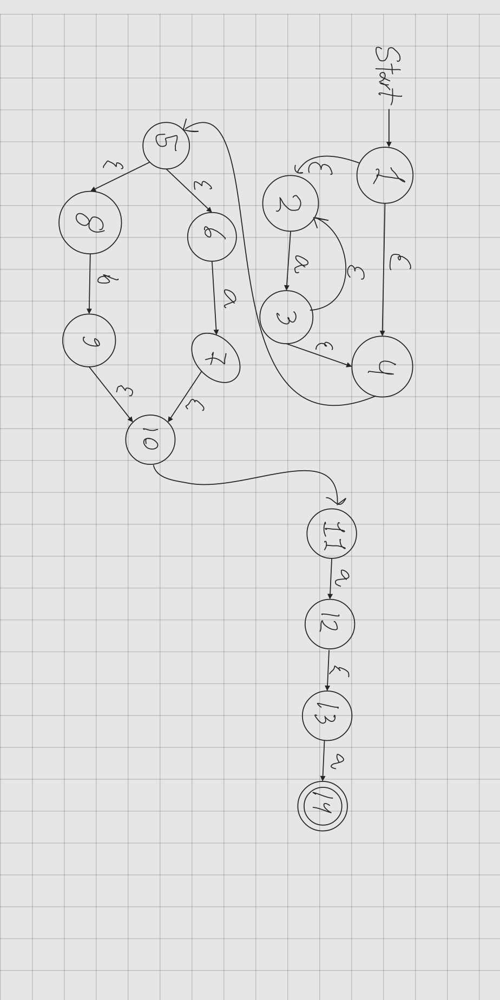
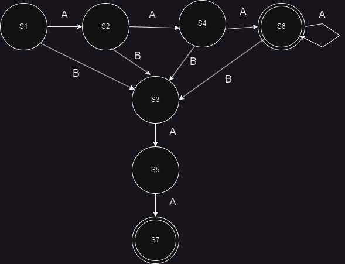
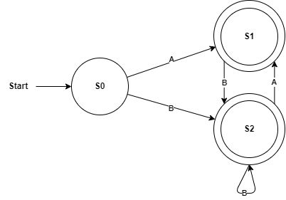

# Question 1

we have all things for ex1 in the folder called lexer
## Read the specification hello.fsl !
Done

## What are the regular expressions involved ?
Digits

## Which semantic values are they associated with ?
Character conversion

# Question 2

##### Generate the lexer out of the specification using a command prompt. 
done

## Which additional file is generated during the process?

We get a .fsi and a .fs file.

## How many states are there by the automaton of the lexer?
9 states

program can be found as lexer.exe if you want to test that it works.
### Exercise BCD 2.1

- (a) 
```regex
\b42\b
```
- (b) 
```
^(?!.*\b42\b)\d+$
```
- (c) 
```regex
^([4-9][3-9]+)|\d{3,}$
```

### Exercise BCD 2.2

#### NFA



#### DFA




## Exercise 3.2

### A

```regex
^a?(b*(ba)*)*$|^(ab)*a?b*$
```

### B


