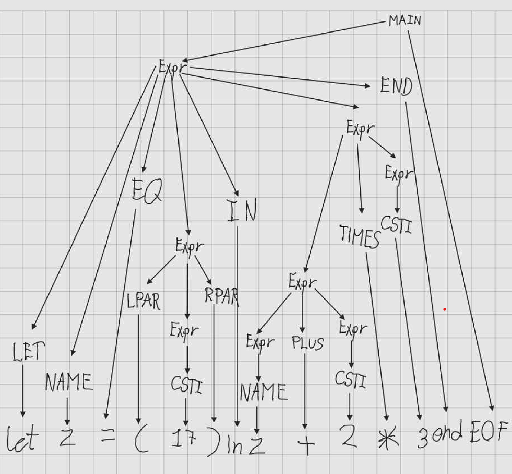

# Answers

## 3.3
1. A -> Expr EOF
2. F -> Let NAME EQ Expr In Expr End EOF
3. G -> Let NAME EQ Expr In Expr TIMES Expr End EOF
4. C -> Let NAME EQ Expr In Expr TIMES CSTI End EOF
5. H -> Let NAME EQ Expr In Expr PLUS Expr TIMES CSTI End EOF
6. C -> Let NAME EQ Expr In Expr PLUS CSTI TIMES CSTI End EOF
7. B -> Let NAME EQ Expr In NAME PLUS CSTI TIMES CSTI End EOF
8. E -> Let NAME EQ LPAR Expr RPAR In NAME PLUS CSTI TIMES CSTI End EOF
9. C -> Let NAME EQ LPAR CSTI RPAR In NAME PLUS CSTI TIMES CSTI End EOF

## 3.4
  
## 3.5

  > fromString "2 + 3 * 4";;

  val it : Absyn.expr = Prim ("+", CstI 2, Prim ("*", CstI 3, CstI 4))

> fromString "1+2* 3";; 
> 
val it : Absyn.expr = Prim ("+", CstI 1, Prim ("*", CstI 2, CstI 3))

> fromString "1-2- 3";;
> 
val it : Absyn.expr = Prim ("-", Prim ("-", CstI 1, CstI 2), CstI 3)

> fromString "1 + -2";;
> 
val it : Absyn.expr = Prim ("+", CstI 1, CstI -2)

> fromString "x++";;
> 
System.Exception: parse error near line 1, column 3

> fromString "1 + 1.2";;
> 
System.Exception: Lexer error: illegal symbol near line 1, column 6

> fromString "1 + ";;
> 
System.Exception: parse error near line 1, column 4

> fromString "let z = 17) in z+2*3 end";;
> 
System.Exception: parse error near line 1, column 11

> fromString "let in = (17) in z+2*3 end";;
> 
System.Exception: parse error near line 1, column 6

> fromString "1 + let x=5 in let y=7+x in y+y end + x end";;
> 
val it : Absyn.expr =
  Prim
    ("+", CstI 1,
     Let
       ("x", CstI 5,
        Prim
          ("+",
           Let
             ("y", Prim ("+", CstI 7, Var "x"), Prim ("+", Var "y", Var "y")),
           Var "x")))

## 3.6

To test run this command in Lex folder:

`fsharpi -r FsLexYacc.Runtime.dll Absyn.fs ExprPar.fs ExprLex.fs Parse.fs Expr.fs`

* Code: 
``` F#

//Should this be with a list of integers like last week or sinstr list as asked in the book? 
let compString (s:string) :sinstr list = 
      let first = Parse.fromString s
      let second = scomp first []
      second 


```

* Example output 
    > Expr.compString "2+2";;

      val it : Expr.sinstr list = [SCstI 2; SCstI 2; SAdd]


## 3.7

* From Absyn
``` F#

module Absyn

type expr = 
  | CstI of int
  | Var of string
  | Let of string * expr * expr
  | Prim of string * expr * expr
  | If of expr * expr * expr


```

* From ExprLex.fsl
``` F#

let keyword s =
    match s with
    | "let" -> LET
    | "in"  -> IN
    | "end" -> END
    | "if" -> IF
    | "then" -> THEN
    | "else" -> ELSE
    | _     -> NAME s
}

```

* From ExprPar
``` F#


%token <int> CSTINT
%token <string> NAME
%token PLUS MINUS TIMES DIVIDE EQ
%token END IN LET
%token IF THEN ELSE 
%token LPAR RPAR
%token EOF

%left MINUS PLUS        /* lowest precedence  */
%left TIMES             /* highest precedence */

%start Main
%type <Absyn.expr> Main 

%%

Main:
    Expr EOF                            { $1                }
;

Expr:
    NAME                                { Var $1            }
  | CSTINT                              { CstI $1           }
  | MINUS CSTINT                        { CstI (- $2)       }
  | LPAR Expr RPAR                      { $2                }
  | LET NAME EQ Expr IN Expr END        { Let($2, $4, $6)   }
  | Expr TIMES Expr                     { Prim("*", $1, $3) }
  | Expr PLUS  Expr                     { Prim("+", $1, $3) }  
  | Expr MINUS Expr                     { Prim("-", $1, $3) } 
  | IF Expr THEN Expr ELSE Expr         { If($2, $4, $6)    }
;

```

* Testcase 
  > open Parse;;
  > fromString ("if 2 then 3 else 4");;
    
      val it : Absyn.expr = If (CstI 2, CstI 3, CstI 4) 

* Question about assumptions 

      building action table...        shift/reduce error at state 23 on terminal PLUS between {[explicit left 9999] shift(25)} and {noprec reduce(Expr:'IF' Expr 'THEN' Expr 'ELSE' Expr)} - assuming the former because we prefer shift when unable to compare precedences
        shift/reduce error at state 23 on terminal MINUS between {[explicit left 9999] shift(26)} and {noprec reduce(Expr:'IF' Expr 'THEN' Expr 'ELSE' Expr)} - assuming the former because we prefer shift when unable to compare precedences
        shift/reduce error at state 23 on terminal TIMES between {[explicit left 10000] shift(24)} and {noprec reduce(Expr:'IF' Expr 'THEN' Expr 'ELSE' Expr)} - assuming the former because we prefer shift when unable to compare precedences
        time: 00:00:00.0678728
        building goto table...        time: 00:00:00.0012596
        returning tables.
        3 shift/reduce conflicts
        consider setting precedences explicitly using %left %right and %nonassoc on terminals and/or setting explicit precedence on rules using %prec
  
  it seems we made a mistake about precedence, how do we solve this? 

