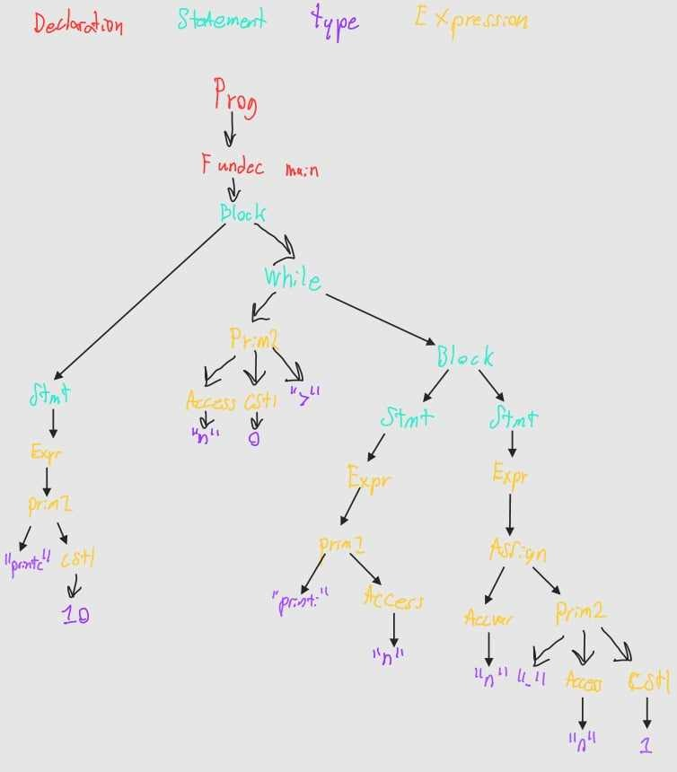

# 7.1
Because the program only have the main function there is only 1 declaration, proceeded by two statements, the while loop on the right and the println on the left.


# 7.2

## (i)

Implementation of arrsum

```c
int *sump;

void main(){
    int array[4];
    array[0] = 7;
    array[1] = 13;
    array[2] = 9;
    array[3] = 8;

    int n;
    n = 4;
    
    arrsum(n, array, sump);
    print *sump;
    println;
}
void arrsum(int n, int arr[], int *sump ){
    int i;
    i = 0;
    int sum;
    sum = 0;

    while(i < n){
        sum = sum + arr[i];
        i = i + 1;
    }
    *sump = sum;
    
}
```

To run it we had to add that main takes an integer to get the result, otherwise it just gave us <fun:Invoke@3236>

```c
run (fromFile "ex72i.c") [4];;
37 
val it : Interp.store =
  map
    [(-1, 37); (0, -1); (1, 4); (2, 7); (3, 13); (4, 9); (5, 8); (6, 2);
     (7, 4); ...]
```

## (ii)

Implementation

```c
int *sump;

void main(int n){
    int array[20];
    squares(n, array);
    arrsum(n, array, sump);

    print *sump;
    println;

}

void squares(int n, int arr[]){
    int i;
    i = 0;

    while(i < n){
        arr[i] = i * i;
        i = i + 1;
    }
}

void arrsum(int n, int arr[], int *sump ){
    int i;
    i = 0;
    int sum;
    sum = 0;

    while(i < n){
        sum = sum + arr[i];
        i = i + 1;
    }
    *sump = sum;
    
}
```
What it returns

```c
run (fromFile "ex72ii.c") [5];;
30 
val it : Interp.store =
  map
    [(-1, 30); (0, -1); (1, 5); (2, 0); (3, 1); (4, 4); (5, 9); (6, 16);
     (7, -999); ...]
```

## (iii)
Implementation
```c

void main(int x){
    int arr[7];
    arr[0] = 1;
    arr[1] = 2;
    arr[2] = 1;
    arr[3] = 1;
    arr[4] = 1;
    arr[5] = 2;
    arr[6] = 0;

    int n;
    n = 7;

    int max;
    max = 4;

    int i;
    i = 0;

    int freq[4];

    while( i < max){
        freq[i] = 0;
        i = i + 1;
    }
   

    histogram(n, arr, max, freq);

    int i;
    i = 0;
    while(i < max){
        print freq[i];
        println;
        i = i + 1;
    }


}

void histogram(int n, int ns[], int max, int freq[]){
    int i;
    i = 0;
    int hotdog;

    while(i < n){
        hotdog = ns[i];
        freq[hotdog] = freq[hotdog] + 1;
        i = i + 1;
    }
}
```
Returns

```c
>  run (fromFile "ex72iii.c") [4];;
1 
4
2
0
val it : Interp.store =
  map
    [(0, 4); (1, 1); (2, 2); (3, 1); (4, 1); (5, 1); (6, 2); (7, 0); (8, 1);
     ...]
```

# 7.3

```c

//Clex.fsl
let keyword s =
    match s with
    | "char"    -> CHAR 
    | "else"    -> ELSE
    | "false"   -> CSTBOOL 0
    | "if"      -> IF
    | "int"     -> INT
    | "null"    -> NULL
    | "print"   -> PRINT
    | "println" -> PRINTLN
    | "return"  -> RETURN
    | "true"    -> CSTBOOL 1
    | "void"    -> VOID 
    | "while"   -> WHILE
    | "for"     -> FOR         
    | _         -> NAME s
//Cpar.fsy
StmtU:
    IF LPAR Expr RPAR StmtM ELSE StmtU  { If($3, $5, $7)       }
  | IF LPAR Expr RPAR Stmt              { If($3, $5, Block []) }
  | WHILE LPAR Expr RPAR StmtU          { While($3, $5)        }
  | FOR LPAR Expr SEMI Expr SEMI Expr RPAR Stmt { Block [Stmt(Expr($3));Stmt(While($5, Block[Stmt($9);Stmt(Expr($7))]))]}
;
```

**7.3i**
``` C 


void main(int n){
    int array[4];
    array[0] = 7;
    array[1] = 13;
    array[2] = 9;
    array[3] = 8;    
    int *sump;

    arrsum(n, array, sump);
    print *sump;
    println;
}
void arrsum(int n, int arr[], int *sump ){
    int i;
    int sum;
    sum = 0;
    for (i = 0; i<n; i = i + 1)
    {
        sum = sum + arr[i];
    }
    *sump = sum;
}

> run (fromFile "ex73i.c") [1];;
7 
val it : Interp.store =
  map
    [(-1, 7); (0, 1); (1, 7); (2, 13); (3, 9); (4, 8); (5, 1); (6, -1); (7, 1);
     ...]


```
**7.3ii**
``` C 

int *sump;

void main(int n){
    int array[20];
    squares(n, array);
    arrsum(n, array, sump);

    print *sump;
    println;

}

void squares(int n, int arr[]){
    int i;
    for (i=0; i<n; i = i + 1)
    {
        arr[i] = i * i;
        i = i + 1;
    }
}

void arrsum(int n, int arr[], int *sump ){
    int i;
    int sum;
    sum = 0;
    for (i = 0; i < n; i = i + 1)
    {
        sum = sum + arr[i];
    }
    *sump = sum;
    
}

> run (fromFile "ex73ii.c") [1];; 
0
val it : Interp.store =
  map
    [(-1, 0); (0, -1); (1, 1); (2, 0); (3, -999); (4, -999); (5, -999);
     (6, -999); (7, -999); ...]


```
**7.3iii**
``` C 

void main(int x){
    int arr[7];
    arr[0] = 1;
    arr[1] = 2;
    arr[2] = 1;
    arr[3] = 1;
    arr[4] = 1;
    arr[5] = 2;
    arr[6] = 0;

    int n;
    n = 7;

    int max;
    max = 4;

    int i;
    int freq[4];
    for ( i = 0; i < max; i = i + 1)
    {
        freq[i] = 0;
    }
   

    histogram(n, arr, max, freq);

    int i;
    for (i = 0; i < max; i = i + 1)
    {
        print freq[i];
        println;
    }


}

void histogram(int n, int ns[], int max, int freq[]){
    int i;
    
    int hotdog;
    for(i = 0;i < n;i = i + 1)
    {
        hotdog = ns[i];
        freq[hotdog] = freq[hotdog] + 1;
    }
}

> run (fromFile "ex73iii.c") [1];; 
1 
4
2
0
val it : Interp.store =
  map
    [(0, 1); (1, 1); (2, 2); (3, 1); (4, 1); (5, 1); (6, 2); (7, 0); (8, 1);
     ...]

```

# 7.4

# 7.5
